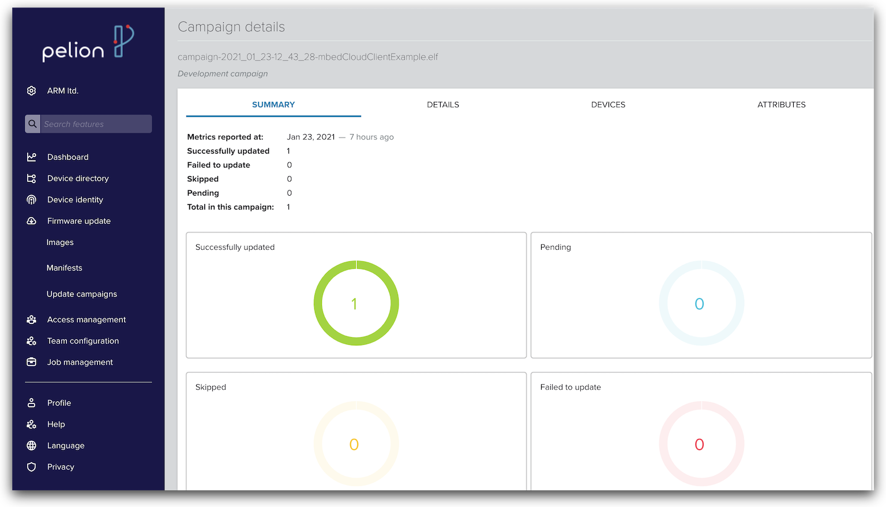
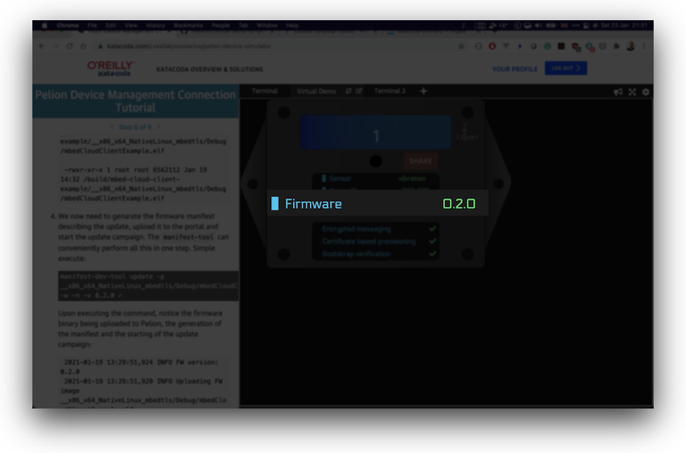

# Virtual demo for Pelion 
[](https://www.katacoda.com/cvasilak/scenarios/pelion-device-simulator)


## Introduction

The virtual demo for Pelion is a software only device that connects to the Pelion Device Management service so that the service can be used and demonstrated without the requirement for any device hardware. The project was specifically created to help discussion of high level device management topics with the constraints of travel due to the Covid-19 pandemic but can be used any time that a screen share demo would be useful when a face to face physical demo isn't possible.

An example demo walkthrough script is provided that gives an example of where the virtual demo can be used:
[Pelion-virtual-demo-script.md](Pelion-virtual-demo-script.md)

To use this demo you'll need to have a Pelion Device Management account, visit the [Pelion Device Management](portal.mbedcloud.com) site to sign up for an account if you don't already have one.

Running the demo will register a device to your account and allow you to see and write values to and from the device from the device management service in real time via your Internet link.

**Note** This demo is great for:

* Demoing a connected device on a computer so that you can explain IoT device management without the overhead of configuring and running up physical hardware
* Running a real Pelion Device Management demo in a video call screen share
* Quickly and easily connecting a device so that you can experiment with the Pelion Device Management Portal in real time
* Testing out the FOTA firmware update tools that Pelion Device Management provides
* Connecting a device as part of your work to implement and test the REST API for Pelion Device Management. Pelion doesn't know that this is a virtual demo device

The demo is *not intended* to be used as a:

* Starter template for a constrained, low power IoT device. The Linux platform that we use to be able to demo the device on a computer is too heavy weight for a constrained hardware device. We suggest you apply the concepts explained here to an application running on an mbed enabled board.
* Method of running firmware update management for Linux IoT devices. The firmware update method demoed here is for single-application updates. When you're working with real Linux IoT devices you should implement update methods for Linux packages and any application libraries that you use. We suggest that you take a look at Pelion Edge if you're implementing that type of product.

## Updates
* V1.1 Feb 2021
	* Mbed cloud client updated to v4.7.0
	* Firmware update added including delta update generation
	* Multi-sensor type support. Inclusion of an option to build a counter-type device with the same functionality as mbed cloud client example

## Quick start:
The virtual demo can be run using a docker container without any code changes. You can run the environment locally on your machine or you can use our walkthrough on [Katakoda](https://www.katacoda.com/cvasilak/scenarios/pelion-device-simulator). 

If you're running the demo locally then docker needs to be installed on your host machine [https://www.docker.com/products/docker-desktop](https://www.docker.com/products/docker-desktop). A docker image has been prepared and uploaded to the docker hub site, the commands below will pull the pelion/virtual-demo image from docker hub and run and instance on your machine

1. Generate an Access key from [Pelion Device management Portal](https://portal.mbedcloud.com/). You'll find the Access keys in the Access Management section.

2. Start the `pelion/virtual-demo` container image replacing `CLOUD_SDK_API_KEY` with your key:

    ```
    docker run --name pelion-demo -p 8888:8888 -e CLOUD_SDK_API_KEY=<YOUR_PELION_API_KEY> pelion/virtual-demo
    ```
    
3. Point your web browser to [http://localhost:8888](http://localhost:8888) to access the user interface of the virtual device.

4. Note the deviceID and find the device in your device list on the Pelion Device Management Portal. You can now browse resources and see the data updates from the virtual device in real time.

Kill the demo with CTRL-C. The docker container running this instance of the demo will be suspended. You can choose to come back to this same container and resume it at a later date (the deviceID will be preserved), or you can issue a fresh `docker run` command to create a new device instance and a new device in your device directory.
```
docker restart pelion-demo
docker attach pelion-demo
```

## Specifying the device type
The default device type built by this project is a vibration sensor. If you want to build a counter device instead, useful if you're running an IoT project built around the standard mbed cloud client example code running on an mbed enabled board but you want to use a software device instead, the add `-e SENSOR=counter` to the docker run instruction.
    ```
    docker run --name pelion-demo -p 8888:8888 -e CLOUD_SDK_API_KEY=<YOUR_PELION_API_KEY> -e SENSOR=counter pelion/virtual-demo
    ```

## Performing firmware update
The docker image comes already pre-configured with the necessary tools to perform a firmware and delta update. In particular, build tools and the suite of tools from [manifest-tool](https://github.com/PelionIoT/manifest-tool) are included to a) create a delta firmware image and b) sign and produce a firmware manifest ready to be uploaded to Pelion portal to start an update campaign. 

> For more information about Pelion Device Management update, please consult our [documentation page.](https://developer.pelion.com/docs/device-management/current/updating-firmware/index.html)

Let's change the firmware code running on the virtual device, to simulate a code change and subsequent firmware update. With the docker container running, open a new terminal. Then:

1. Clone the virtual demo repository locally:

    ```
    $ git clone https://github.com/PelionIoT/virtual-demo-for-pelion.git && \
    cd virtual-demo-for-pelion
    ```

2. Switch to the directory where the 'firmware' source code is located:
    ```
    $ cd mbed-cloud-client-example
    ```

3. Copy credential sources and manifest-tool configuration from the running docker container to your local folder::

    ```
    $ docker cp pelion-demo:/build/mbed-cloud-client-example/mbed_cloud_dev_credentials.c . && \
    docker cp pelion-demo:/build/mbed-cloud-client-example/update_default_resources.c . && \
    docker cp pelion-demo:/build/mbed-cloud-client-example/.manifest-dev-tool .
    ```

    > NOTE: If you are planning to apply a delta patch update, you must also save the existing running firmware, otherwise you can skip the following step:
    
    ```
    $ mkdir firmwares
    $ docker cp pelion-demo:/build/mbed-cloud-client-example/__x86_x64_NativeLinux_mbedtls/Debug/mbedCloudClientExample.elf ./firmwares/current_fw.bin


4. Let's alter the emitted simulated vibration value sent by the virtual demo to be multiplied by 1000. Using `vi` editor, open `source/blinky.cpp` and change the line to the following (line :295):

    ```
    _sensed_count = randomvib * 1000;
    ```

    Save and exit.


5.  Bootstrap a new development container of the virtual demo image to use it for building our new firmware. Notice that we local mount the credential sources and the manifest configuration we copied in step 3 above, so that they are available from inside the new container: 
    ```
    $ docker run -it --name pelion-demo-dev \
     -v $(pwd)/source/blinky.cpp:/build/mbed-cloud-client-example/source/blinky.cpp \
     -v $(pwd)/mbed_cloud_dev_credentials.c:/build/mbed-cloud-client-example/mbed_cloud_dev_credentials.c \
     -v $(pwd)/update_default_resources.c:/build/mbed-cloud-client-example/update_default_resources.c \
     -v $(pwd)/.manifest-dev-tool/:/build/mbed-cloud-client-example/.manifest-dev-tool/ \
     pelion/virtual-demo bash
    ```
    > NOTE: If planning to perform delta patch update, we need to local mount the 'firmwares/' directory too. Simply append `-v $(pwd)/firmwares/:/build/mbed-cloud-client-example/firmwares` in the command above.


You can now choose either to perform a full firmware image update or a delta patch. Follow the appropriate section below.

### Option 1 - Full Image Update

1. Switch to the firmware source code directory:
    ```
    cd /build/mbed-cloud-client-example/
    ```

2. Build the new firmware image by invoking the `make` tool:
    ```
    make -C __x86_x64_NativeLinux_mbedtls/ mbedCloudClientExample.elf
    ```

3. Upon completion of the build, a new firmware binary is generated:
    ```
    $ ls -l /build/mbed-cloud-client-example/__x86_x64_NativeLinux_mbedtls/Debug/mbedCloudClientExample.elf
    
    -rwxr-xr-x 1 root root 6562120 Jan 27 11:11 mbedCloudClientExample.elf
    ```
4. We now need to generate the firmware manifest describing the update, upload it to the portal and start an update campaign. The `manifest-tool` can conveniently perform all this in one step. Simple execute:

    ```
    $ manifest-dev-tool update -p __x86_x64_NativeLinux_mbedtls/Debug/mbedCloudClientExample.elf -w -n -v 0.2.0

    INFO FW version: 0.2.0
    INFO Uploading FW image __x86_x64_NativeLinux_mbedtls/Debug/mbedCloudClientExample.elf
    INFO Uploaded FW image http://firmware-catalog-media-ca57.s3.dualstack.us-east-1.amazonaws.com/C8Kkvr7VX40kE5lMnBExia
    INFO Vendor-ID: b7316c2bd3a74aa39feb30692acf2d63
    INFO Class-ID: 298ac90070eb4337b6adbbf82bbe8471
    INFO Created manifest in v3 schema for full update campaign
    INFO Uploaded manifest ID: 0177439e95060000000000010010002d
    INFO Created Campaign ID: 0177439e96e200000000000100100399
    INFO Started Campaign ID: 0177439e96e200000000000100100399
    INFO Campaign state: publishing
    INFO Campaign state: autostopped
    INFO Campaign is finished in state: autostopped
    INFO ----------------------------
    INFO     Campaign Summary
    INFO ----------------------------
    INFO  Successfully updated:   1
    INFO  Failed to update:       0
    INFO  Skipped:                0
    INFO  Pending:                0
    INFO  Total in this campaign: 1
    ```

    At the console prompt of the virtual demo, notice the firmware update being initiated, then downloaded and applied:
    ```
    [FOTA INFO] fota.c:596: Firmware update initiated.
    [FOTA DEBUG] fota.c:628: Pelion FOTA manifest is valid
    [FOTA DEBUG] fota.c:651: get manifest : curr version 0, new version 131072
    [FOTA DEBUG] fota_source_profile_full.cpp:444: Reporting resource: /10252/0/2: value: 3
    [FOTA DEBUG] fota_source_profile_full.cpp:153: Callback for resource: /10252/0/2 status: 3 type: 0
    [FOTA DEBUG] fota_source_profile_full.cpp:153: Callback for resource: /10252/0/2 status: 4 type: 0
    [FOTA DEBUG] fota.c:555: Download Authorization requested
    [FOTA] ---------------------------------------------------
    [FOTA] Updating component MAIN from version 0.0.0 to 0.2.0
    [FOTA] Update priority 0
    [FOTA] Update size 6562120B
    [FOTA] ---------------------------------------------------
    [FOTA] Download authorization granted
    [FOTA DEBUG] fota_event_handler.c:61: FOTA event-handler got event [type= 4]
    [FOTA INFO] fota.c:1351: Download authorization granted.
    [FOTA DEBUG] fota_block_device_linux.c:77: FOTA BlockDevice init file is fota_candidate
    [FOTA DEBUG] fota.c:1128: FOTA BlockDevice initialized
    [FOTA DEBUG] fota.c:522: New FOTA key saved
    [FOTA DEBUG] fota.c:533: FOTA encryption engine initialized
    [FOTA DEBUG] fota.c:1216: Erasing storage at 0, size 4294967296
    [FOTA DEBUG] fota_source_profile_full.cpp:444: Reporting resource: /10252/0/2: value: 4
    [FOTA DEBUG] fota_source_profile_full.cpp:153: Callback for resource: /10252/0/2 status: 3 type: 0
    [FOTA] Downloading firmware. 0%
    [FOTA] Downloading firmware. 5%
    [FOTA] Downloading firmware. 10%
    [FOTA] Downloading firmware. 15%
    [FOTA] Downloading firmware. 20%
    [FOTA] Downloading firmware. 25%
    [FOTA] Downloading firmware. 30%
    [FOTA] Downloading firmware. 35%
    [FOTA] Downloading firmware. 40%
    [FOTA] Downloading firmware. 45%
    [FOTA] Downloading firmware. 50%
    [FOTA] Downloading firmware. 55%
    [FOTA] Downloading firmware. 60%
    [FOTA] Downloading firmware. 65%
    [FOTA] Downloading firmware. 70%
    [FOTA] Downloading firmware. 75%
    [FOTA] Downloading firmware. 80%
    [FOTA] Downloading firmware. 85%
    [FOTA] Downloading firmware. 90%
    [FOTA] Downloading firmware. 95%
    [FOTA] Downloading firmware. 100%
    [FOTA INFO] fota.c:1509: Firmware download finished
    [FOTA DEBUG] fota_source_profile_full.cpp:444: Reporting resource: /10252/0/2: value: 6
    [FOTA DEBUG] fota_source_profile_full.cpp:153: Callback for resource: /10252/0/2 status: 4 type: 0
    [FOTA DEBUG] fota.c:1460: Install Authorization requested
    [FOTA] Install authorization granted
    [FOTA DEBUG] fota_source_profile_full.cpp:153: Callback for resource: /10252/0/2 status: 3 type: 0
    [FOTA DEBUG] fota_event_handler.c:61: FOTA event-handler got event [type= 4]
    [FOTA INFO] fota.c:1346: Install authorization granted.
    [FOTA DEBUG] fota_source_profile_full.cpp:444: Reporting resource: /10252/0/2: value: 7
    [FOTA DEBUG] fota_source_profile_full.cpp:153: Callback for resource: /10252/0/2 status: 4 type: 0
    [FOTA INFO] fota.c:804: Installing new version for component MAIN
    [FOTA INFO] fota_candidate.c:224: Found an encrypted image at address 0x0
    [FOTA INFO] fota_candidate.c:416: Validating image...
    [FOTA INFO] fota_candidate.c:461: Image is valid.
    [FOTA INFO] fota_component.c:189: Installing MAIN component
    [FOTA] Successfully installed MAIN component

    [FOTA DEBUG] fota_source_profile_full.cpp:444: Reporting resource: /10252/0/2: value: 8
    [FOTA DEBUG] fota_source_profile_full.cpp:153: Callback for resource: /10252/0/2 status: 3 type: 0
    Resource(3313/0/5700) automatically updated. Value 6
    [FOTA DEBUG] fota_source_profile_full.cpp:153: Callback for resource: /10252/0/2 status: 4 type: 0
    [FOTA INFO] fota.c:725: Rebooting.
    In single-partition mode.
    Creating path ./pal
    Start Device Management Client
    ```

## Option 2 - Delta updates


1. Switch to the main program source directory:
    ```
    $ cd /build/mbed-cloud-client-example/
    ```
2. Assuming you've modified `main.cpp` as suggested above, we can now proceed and produce the new firmware:
    ```
    $ make -C __x86_x64_NativeLinux_mbedtls/ mbedCloudClientExample.elf
    ```
3. Copy the new firmware to `firmwares/` directory:
    ```
    $ cp __x86_x64_NativeLinux_mbedtls/Debug/mbedCloudClientExample.elf firmwares/new_fw.bin
    ```
4. The `firmwares/` directory should now contain both the new firmware(`new_fw.bin`) and the current running one(`current_fw.bin`):
    ```
    $  ls -l firmwares/
    
    total 12824
    -rwxr-xr-x 1 1000 1000 6562120 Jan 27 10:30 current_fw.bin
    -rwxr-xr-x 1 root root 6562120 Jan 27 10:43 new_fw.bin
    ```
5. We are now ready to generate a delta firmware using the `manifest-delta-tool`:
    ```
    $ manifest-delta-tool -c firmwares/current_fw.bin -n firmwares/new_fw.bin -o firmwares/delta-patch.bin

    2021-01-27 10:44:30,382 INFO Current tool version PELION/BSDIFF001
    Wrote diff file firmwares/delta-patch.bin, size 245215. Max undeCompressBuffer frame size was 512, max deCompressBuffer frame size was 189.
    ```
    
    If we list the directory contents, we can verify the producing of the `delta-patch.bin` firmware. Notice the significant shrinkage in size, from 6.3MB of a full firmware image, down to a delta of 240K!

    ```
    ls -l firmwares/delta-patch.bin

    -rw-r--r-- 1 root root  245215 Jan 27 10:44 delta-patch.bin
    ```

6. Start the update campaign
    ```
    $ manifest-dev-tool update -p firmwares/delta-patch.bin -w -n -v 0.2.0

    INFO FW version: 0.2.0
    INFO Uploading FW image firmwares/delta-patch.bin
    INFO Uploaded FW image http://firmware-catalog-media-ca57.s3.dualstack.us-east-1.amazonaws.com/UttMp3crVuNntkxuNobTZI
    INFO Vendor-ID: d3b2b23d842441739c666ee5cf74e594
    INFO Class-ID: 90f4bdec6c0e483c8ecec3fbec8ba4fc
    INFO Created manifest in v3 schema for delta update campaign
    INFO Uploaded manifest ID: 017743762a0400000000000100100006
    INFO Created Campaign ID: 017743762bb800000000000100100387
    INFO Started Campaign ID: 017743762bb800000000000100100387
    INFO Campaign state: publishing
    INFO Campaign state: autostopped
    INFO Campaign is finished in state: autostopped
    INFO ----------------------------
    INFO     Campaign Summary 
    INFO ----------------------------
    INFO  Successfully updated:   1
    INFO  Failed to update:       0
    INFO  Skipped:                0
    INFO  Pending:                0
    INFO  Total in this campaign: 1
    ```

    At the console prompt of the virtual demo, notice that the device logs the downloading of the new firmware, the verification of the manifest and the successful delta update:
    ```
    [FOTA INFO] fota.c:596: Firmware update initiated.
    [FOTA DEBUG] fota.c:628: Pelion FOTA manifest is valid
    [FOTA DEBUG] fota.c:651: get manifest : curr version 0, new version 131072 
    [FOTA DEBUG] fota_source_profile_full.cpp:444: Reporting resource: /10252/0/2: value: 3
    [FOTA DEBUG] fota_source_profile_full.cpp:153: Callback for resource: /10252/0/2 status: 3 type: 0
    [FOTA DEBUG] fota_source_profile_full.cpp:153: Callback for resource: /10252/0/2 status: 4 type: 0
    [FOTA DEBUG] fota.c:555: Download Authorization requested
    [FOTA] ---------------------------------------------------
    [FOTA] Updating component MAIN from version 0.0.0 to 0.2.0
    [FOTA] Update priority 0
    [FOTA] Delta update. Patch size 245215B full image size 6562120B
    [FOTA] ---------------------------------------------------
    [FOTA] Download authorization granted
    [FOTA DEBUG] fota_event_handler.c:61: FOTA event-handler got event [type= 4]
    [FOTA INFO] fota.c:1351: Download authorization granted.
    [FOTA DEBUG] fota_block_device_linux.c:77: FOTA BlockDevice init file is fota_candidate
    [FOTA DEBUG] fota.c:1128: FOTA BlockDevice initialized
    [FOTA DEBUG] fota.c:522: New FOTA key saved
    [FOTA DEBUG] fota.c:533: FOTA encryption engine initialized
    [FOTA DEBUG] fota.c:1216: Erasing storage at 0, size 4294967296
    [FOTA DEBUG] fota.c:1258: FOTA delta engine initialized
    [FOTA DEBUG] fota_source_profile_full.cpp:444: Reporting resource: /10252/0/2: value: 4
    [FOTA DEBUG] fota_source_profile_full.cpp:153: Callback for resource: /10252/0/2 status: 3 type: 0
    [FOTA] Downloading firmware. 3%
    [FOTA] Downloading firmware. 9%
    [FOTA] Downloading firmware. 11%
    [FOTA] Downloading firmware. 17%
    [FOTA] Downloading firmware. 22%
    [FOTA] Downloading firmware. 27%
    [FOTA] Downloading firmware. 31%
    [FOTA] Downloading firmware. 35%
    [FOTA] Downloading firmware. 40%
    [FOTA] Downloading firmware. 45%
    [FOTA] Downloading firmware. 54%
    [FOTA] Downloading firmware. 58%
    [FOTA] Downloading firmware. 63%
    [FOTA] Downloading firmware. 68%
    [FOTA] Downloading firmware. 72%
    [FOTA] Downloading firmware. 77%
    [FOTA] Downloading firmware. 82%
    [FOTA] Downloading firmware. 86%
    [FOTA] Downloading firmware. 91%
    [FOTA] Downloading firmware. 96%
    [FOTA] Downloading firmware. 100%
    [FOTA INFO] fota.c:1509: Firmware download finished
    [FOTA DEBUG] fota_source_profile_full.cpp:444: Reporting resource: /10252/0/2: value: 6
    [FOTA DEBUG] fota_source_profile_full.cpp:153: Callback for resource: /10252/0/2 status: 4 type: 0
    [FOTA DEBUG] fota.c:1460: Install Authorization requested
    [FOTA] Install authorization granted
    [FOTA DEBUG] fota_source_profile_full.cpp:153: Callback for resource: /10252/0/2 status: 3 type: 0
    [FOTA DEBUG] fota_event_handler.c:61: FOTA event-handler got event [type= 4]
    [FOTA INFO] fota.c:1346: Install authorization granted.
    [FOTA DEBUG] fota_source_profile_full.cpp:444: Reporting resource: /10252/0/2: value: 7
    [FOTA DEBUG] fota_source_profile_full.cpp:153: Callback for resource: /10252/0/2 status: 4 type: 0
    [FOTA INFO] fota.c:804: Installing new version for component MAIN
    [FOTA INFO] fota_candidate.c:224: Found an encrypted image at address 0x0
    [FOTA INFO] fota_candidate.c:416: Validating image...
    [FOTA INFO] fota_candidate.c:461: Image is valid.
    [FOTA INFO] fota_component.c:189: Installing MAIN component
    [FOTA] Successfully installed MAIN component

    [FOTA DEBUG] fota_source_profile_full.cpp:444: Reporting resource: /10252/0/2: value: 8
    [FOTA DEBUG] fota_source_profile_full.cpp:153: Callback for resource: /10252/0/2 status: 3 type: 0
    [FOTA DEBUG] fota_source_profile_full.cpp:153: Callback for resource: /10252/0/2 status: 4 type: 0
    [FOTA INFO] fota.c:725: Rebooting.
    In single-partition mode.
    Creating path ./pal
    Start Device Management Client
    ```

## Verifying Firmware Update

Once the firmware update is completed, the Pelion update campaign dashboard should display the successfully completion:



and the device should display the new firmware version (0.2.0 in our case):



Notice now that the vibration sensor values sent by the device are indeed multiplied by 1000 marking the successful firmware update!

**Congratulations !**


## Technical overview
The demo has been implemented to be run in 2 parts
1) an instance of the Pelion device management client built with your certificate that writes sensor values to the linux message queue running inside the docker container
2) a graphical representation (GUI) of a device that picks up the sensor values from the queue and displays values in a "fake device" so that conversations about managed devices can take place.

Our pre-existing docker image has a linux environment and a pre-built set of objects to run the demo. When you use the `docker run` command with your Access key as an argument the scripts inside the container use the Access key to retrieve a device certificate from your Pelion Device Management account and finalise the compilation of the client using your certificate. The client instance is then run, a `firstrun` file is written to the root of the docker container's linux environment, and the demo is running. The client passes values to the GUI using the linux message queue running inside the container, the the GUI is rendered on port 8888 of your local machine, the vibration values can be seen under the 3313/0/5700 resource for this device listed in the Pelion device management portal.

When you kill the demo with `CTRL-C` you are halting the docker container ´pelion-demo´ but not destroying it. When you start the demo with the supplied launch scripts you are resuming the previously halted container, this solution means that the pelion client is re-used and the same Pelion deviceID used over multiple demo sessions. If you don't use the restart command in the launch scripts and instead issue a `docker run` command then a fresh instance of the docker image will be created as a new container, which in turn means a fresh instance of the client will be executed, and a new deviceID will be issued by Pelion. This would create a growing list of stale devices in the device directory list of the Pelion portal webpage so we use the resume feature instead.

## Developing with the virtual demo:
The virtual demo docker image and the contents of this github repo can be used together as an environment to tweak and build your own modifications to the demo. Clone this demo to your local machine and use the following commands to mount the cloned directories inside the docker image, the result will be that any code changes you make to the repo's files on your machine can be built and executed inside the docker container.

1. Generate an Access key from Pelion Device management Portal

2. Start the `pelion/virtual-demo` container image from the root of the cloned repo replacing `CLOUD_SDK_API_KEY` with your key and add `-e SENSOR=counter` if you want to build a counter device instead of the default vibration sensor:

    ```
   docker run -it --name pelion-demo-dev -p 8888:8888 -v $(pwd):/build -e CLOUD_SDK_API_KEY=<YOUR_API_KEY> pelion/virtual-demo bash
    ```
This will create a container with the name tag "pelion-demo-dev" that is running the pelion/virtual-demo image with a bind mount folder on your local machine. You can use the pelion-demo-dev container name if you exit the running container and want to return to it with docker restart and resume commands.

3. You'll be at the bash shell inside the container, you now need to create the build environment to allow the demo to be rebuilt with your changes

```
cd ../mbed-cloud-client-example
mbed config root .
mbed deploy
python3 pal-platform/pal-platform.py deploy --target=x86_x64_NativeLinux_mbedtls generate
cd __x86_x64_NativeLinux_mbedtls
cmake -G "Unix Makefiles" -DCMAKE_BUILD_TYPE=Debug -DCMAKE_TOOLCHAIN_FILE=./../pal-platform/Toolchain/GCC/GCC.cmake \
    -DEXTERNAL_DEFINE_FILE=./../define_linux_update.txt -DFOTA_ENABLE=ON -DFOTA_TRACE=ON
cd ../../sim-webapp
```

4. To build your changes you can use the sim-webapp.py python script. The first build will require all object files to be built, this can take 30+ minutes but subsequent builds will only rebuild your modifications. At the end of each build the script adds a marker `firstrun` file to the sim-webapp directory to ensure further executions of the script only cause the demo to be executed and not compiled again. Similarly a `certexists` file in the root of the docker container ensures that the certificate for your device is only pulled once. To kick a fresh compilation of your code changes use

``` 
rm -f firstrun && python3 sim-webapp.py
```

5. When the system has compiled your changes and the demo is running you'll see the console output at the bash shell, and you'll find the webapp running at the [localhost:8888](http://localhost:8888) URL on your host machine.
